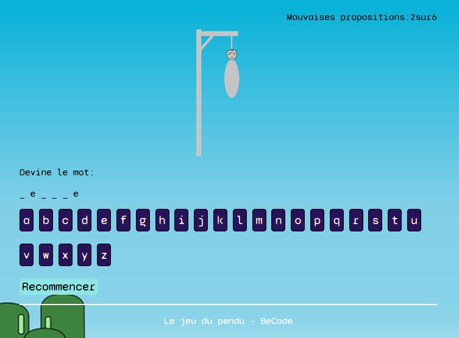

<h1 align="center"> Hangman </h1>

  

This challenge consists in the creation of a hangman in Javascript in solo. 

  

In this repository, we can find the architecture of the site in the `html` file. The style file was written in SCSS and the dynamic interaction in vanilla javascript. 

[Hangman](https://calcagnoloic.github.io/Hangman/)
