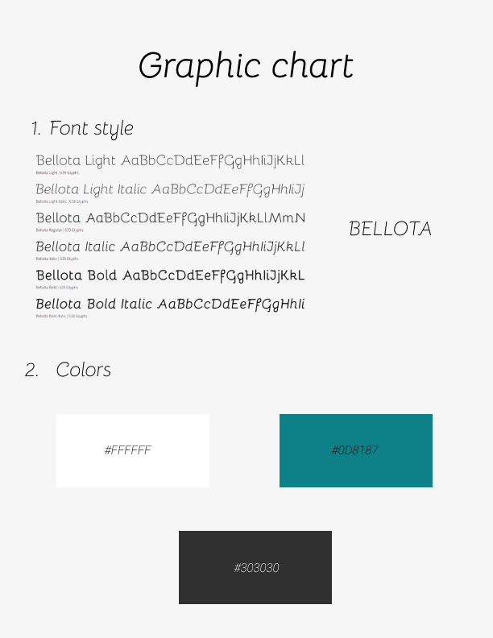
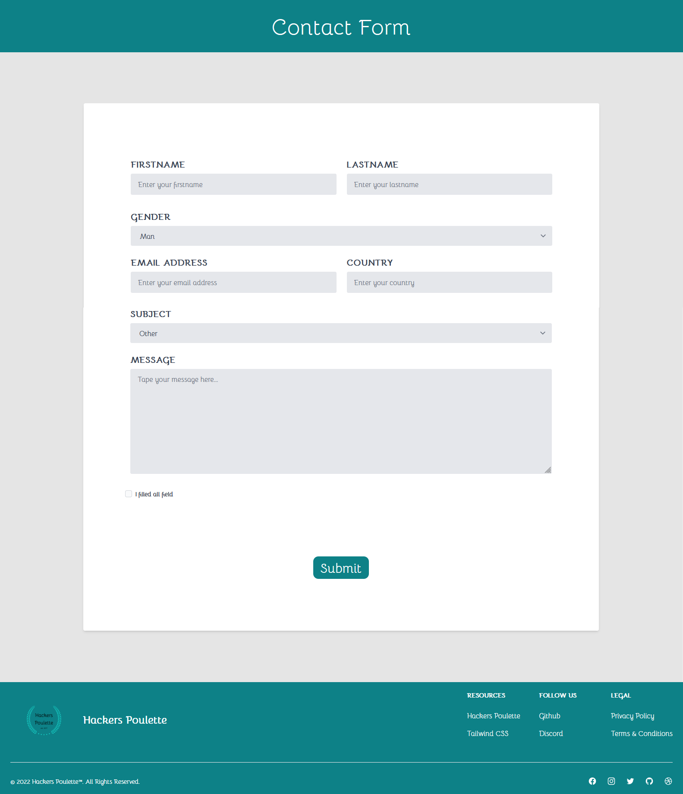
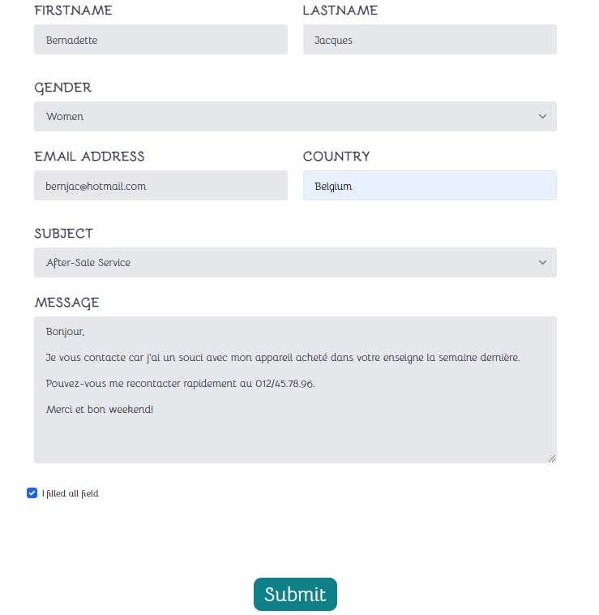
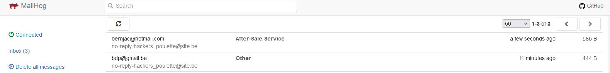
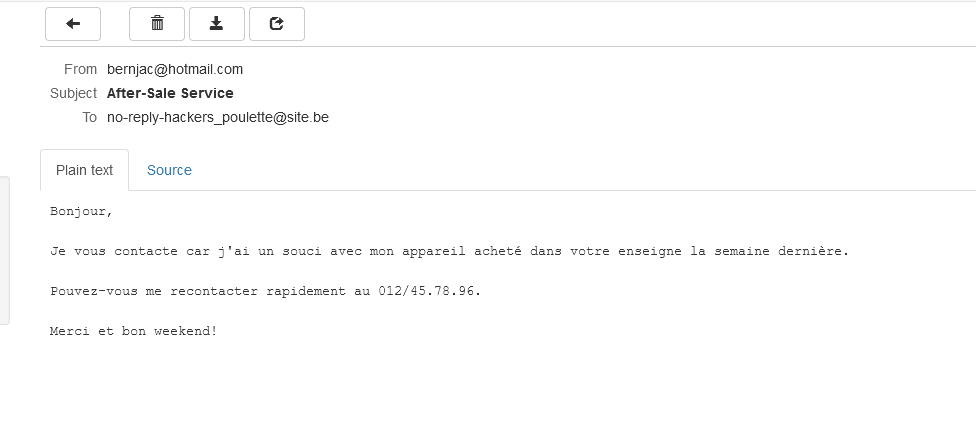

<h1 align="center">Contact Form</h1>

    
    
    
    
    
    
    
    
    
    
    

<h2>Project context</h2>

3-day solo project.

The goal of this project is to create a contact form using backend technologies (PHP and MySQL). In addition, a framework is used for the frontend. 

[Here](https://www.figma.com/file/LXVmld75daQsyT3aBOrdGa/Hacker-Poulette?node-id=0%3A1), you can find the mock-up Figma used to design the form.

<h2>Graphic Chart</h2>

<h2>Contact form</h2>

<h2>Sending of the email</h2>

