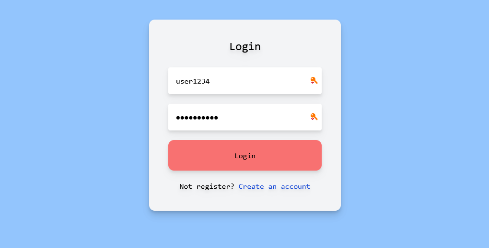
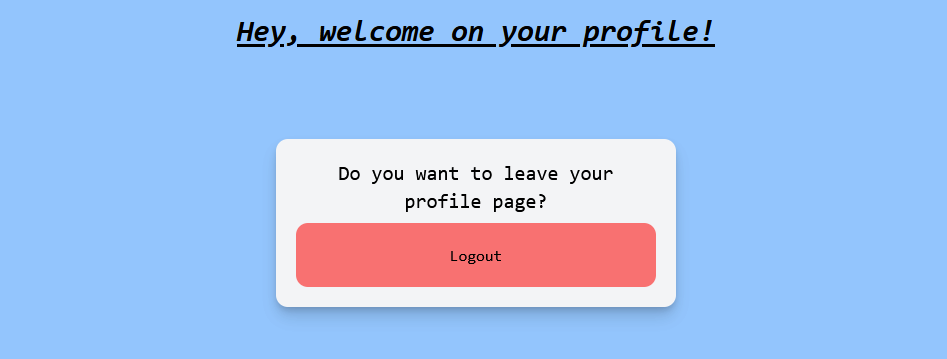

# LoginPage with fastAPI and react router 6

    
    
    
    
    
    

Création d'une page de connection de type `Login/Logout` avec les fastAPI, React et React Router.

Si vous voulez essayer le formulaire, assurez vous bien de réaliser 3 choses : 

1. Mettre en route le serveur côté back avec un `python main.py` et en installant les dépendances du fichier `requirements.txt`

2. Mettre en route le serveur côté front avec un `npm install` et `npm start`

3. Mettre `user1234` comme username et `secret1234` comme mot de passe

